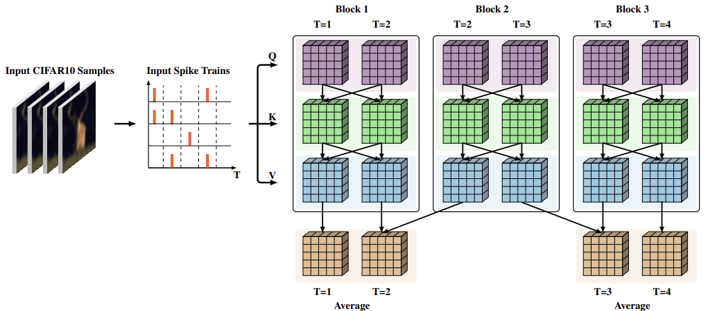

# obSTAtten: overlapping-block Spiking Transformer with Spatial-Temporal Attention

<p align="center">

</p>

## Abstract
Spatial-temporal attention models for spiking transformers, such as STAtten and STSSA, extend self-attention into the temporal domain to better exploit the inherent temporal structure of spiking neural networks. STAtten uses non-overlapping blocks that contain groups of timesteps. These timesteps are compared within each block to provide segmented temporal attention. Alternatively, STSSA compresses the spatial dimension via max-pooling into representative temporal tokens, then applies a k-order temporal window to restrict each timestep to only access current and recent information. By introducing overlapping temporal blocks into STAtten, a new model (obSTAtten) is proposed that reduces the strict partitioning of non-overlapping block-wise attention while remaining within the STAtten framework. The attention model obSTAtten conditionally improves upon or rivals the performance of STAtten when tested with static input via the CIFAR10 dataset, and requires roughly the same training time in most cases. There is a bigger benefit to the use of obSTAtten in LIF models when compared with PLIF models.

## Dependencies
(Same as STAtten)
- timm == 0.6.12
- pytorch == 1.13.1
- cupy
- spikingjelly == 0.0.0.0.12
- tensorboard

## Training Data
(Same as STAtten) [This section copied from original repo for convinience]
- CIFAR10-DVS: Download through Spikingjelly framework
- N-Caltech101: Download through Spikingjelly framework
- ImageNet: https://www.image-net.org/index.php
```
conf
├── ...
data
├── CIFAR10/100
│   └── ...
├── CIFAR10-DVS
│   ├── frames_number_10_split_by_number
│   └── frames_number_16_split_by_number
├── N-Caltech101
│   ├── frames_number_10_split_by_number
│   └── frames_number_16_split_by_number
├── ImageNet
│   └── ...
```

## Usage
The steps taken to run STAtten/obSTAtten are slightly more complicated than their readme made it seem, so I will include the instructions that worked on my machine, note I was using a GTX 1070 TI on Debian.

After ensuring CUDA-12x is installed (that is the version I found sucsess with), create a conda environment in which all listed dependencies and python are installed into. Once this is done run the command:
```
torchrun --nproc_per_node=1 train.py \
  -c conf/cifar10/2_512_200E_t4.yml \
  --model sdt \
  --spike-mode lif \
  --attention_mode STAtten \
  --batch-size 4
```
This will start training a model using STAtten attention, with dim=512, spike_mode=lif using CIFAR10. Any train file in the /conf file tree can be used instead of 'conf/cifar10/2_512_200E_t4.yml' which allows different datasets (eg CIFAR10-DVS) and dimention sizes to be run. Note that spike-mode (lif or plif) and attention_mode (SDT, STAtten, obSTAtten) can all be chosen regardless of which train file is selected.

## Output Data

## Ackonwledgements
This project is based on this GitHub Repository: https://github.com/Intelligent-Computing-Lab-Panda/STAtten
The linked repository was modified in the following ways for this project:
- Added an attention model called obSTAtten to ms_conv.py and ensured the code was reachable
- Modified obSTAtten to have the following characteristics
  - Overlapping blocks with 1 timestep of overlap and 1 timestep of stride
  - Averaging the contribution of these overlapped timesteps to preserve model output
  - This model is described by the image at the top of this readme file, all other attention behavior is inherited from STAtten

The source repository was based on the following code:
- Spike-driven Transformer: https://github.com/BICLab/Spike-Driven-Transformer
- Spikingjelly: https://github.com/fangwei123456/spikingjelly

## Citation
If you found this paper useful or interesting and would like to cite it or derive from it, the citation (in BibTex) is shown below. This paper is not published as it is a class paper however it will be hosted here indefinitely:
```
@misc{obSTAtten,
  author       = {Esebag, Brandon},
  title        = {Modification to {STAtten} for Overlapping Temporal Blocks},
  year         = {2026},
  publisher    = {GitHub},
  journal      = {GitHub repository},
  howpublished = {\url{https://github.com/rancorjoy/obSTAtten}},
  note         = {GitHub repository}
}
